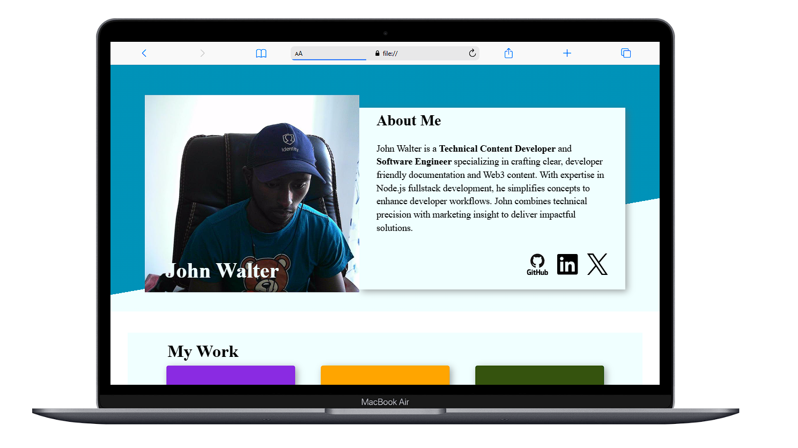

# Personal Homepage

This is a personal homepage built as part of [The Odin Project's](https://www.theodinproject.com/lessons/node-path-advanced-html-and-css-homepage) Advanced HTML and CSS curriculum.

The goal of this project is to demonstrate mastery of semantic HTML, responsive design, accessibility, browser compatibility, and modern CSS practices.

## 🔍 Features

- 💡 **Semantic HTML5**: Proper use of `<section>`, `<article>`, `<header>`, `<main>`, etc.
- 🎨 **Custom CSS**: Clean, maintainable stylesheet with utility classes and proper structure.
- 📱 **Responsive Design**: Mobile-first layout using media queries for tablet and desktop breakpoints.
- 🧭 **Flexbox & Grid**: Utilized for modern layout techniques to create responsive, adaptive sections.
- 🌐 **Cross-browser Compatibility**: Fixed browser-specific side effects for consistent appearance across Chrome, Firefox, Safari, and Edge.
- ♿ **Accessibility Considerations**: Includes `aria` labels, correct heading hierarchy, and keyboard-friendly navigation.
- 🧪 **Validation**: Passed through HTML and CSS validators to ensure code quality.

## 📸 Preview



## 🚀 Getting Started

Clone this repo:

```bash
git clone https://github.com/john-walter-munene/Homepage.git
cd Homepage
npm install
npm run build
```

## 🤝 Contributing
Suggestions and improvements are welcome! Please open an issue or submit a pull request.